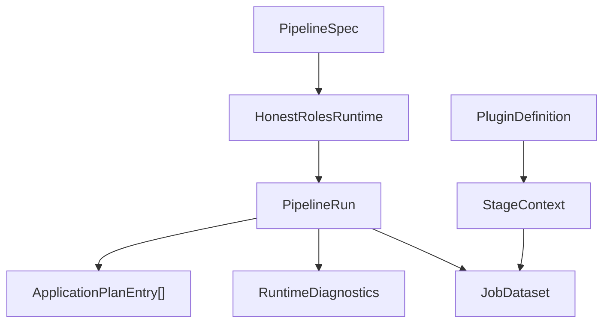

# Fundamental Objects of HonestRoles

This document defines the core object model for HonestRoles.

## Why these objects exist

HonestRoles used to expose its domain implicitly through `polars.DataFrame`, configuration models, and raw nested `dict` diagnostics. The library now makes the domain explicit through typed runtime, dataset, plugin, and diagnostics objects.

## Object catalog

### `PipelineSpec`

- Purpose: executable pipeline definition.
- Owned data: input, output, stages, runtime settings.
- Invariants: strict validated config, resolved file paths, deterministic stage options.
- Produced by: `load_pipeline_config()`.
- Consumed by: `HonestRolesRuntime`.

### `CanonicalJobRecord`

- Purpose: one normalized job posting in the canonical schema.
- Owned data: canonical field values only.
- Invariants: canonical types only; `skills` is immutable tuple data.
- Conversions: `from_mapping()`, `to_dict()`.
- Produced by: `JobDataset.iter_records()` or `JobDataset.materialize_records()`.
- Consumed by: downstream Python callers that need row-level typed access.

### `JobDataset`

- Purpose: stage and plugin I/O object.
- Owned data: canonical Polars frame plus canonical field metadata.
- Invariants: wraps a `pl.DataFrame`; always contains every canonical field; always satisfies canonical logical dtype compatibility; public instances are validated on construction.
- Conversions: `from_polars()`, `to_polars(copy=True)`, `iter_records()`, `materialize_records()`, `with_frame()`, `transform()`.
- Produced by: runtime normalization and any stage/plugin transform.
- Consumed by: stages, plugins, Python API callers, EDA entrypoints.

### `RuntimeDiagnostics`

- Purpose: typed explanation of what happened during a run.
- Owned data: input path, stage row counts, plugin counts, runtime settings, adapter diagnostics, aliasing diagnostics, final row count, non-fatal errors.
- Invariants: deterministic serialization via `to_dict()`.
- Produced by: `HonestRolesRuntime.run()`.
- Consumed by: CLI JSON output, docs examples, troubleshooting workflows.

### `ApplicationPlanEntry`

- Purpose: typed representation of one ranked follow-up action.
- Owned data: rank, title, company, apply URL, fit score, estimated effort.
- Invariants: `fit_rank >= 1`, `estimated_effort_minutes >= 0`.
- Conversions: `to_dict()`.
- Produced by: `match_stage()`.
- Consumed by: `PipelineRun` and downstream callers.

### `PipelineRun`

- Purpose: complete result of one execution.
- Owned data: `JobDataset`, `RuntimeDiagnostics`, `ApplicationPlanEntry[]`.
- Invariants: diagnostics and plan correspond to the returned dataset.
- Produced by: `HonestRolesRuntime.run()`.
- Consumed by: Python API callers, CLI serialization, EDA runtime profiling.

### `SourceAdapterSpec`

- Purpose: declarative source-to-canonical field mapping and coercion rules.
- Owned data: enabled flag, coercion mode, per-field mapping/coercion config.
- Invariants: keys must be canonical fields; `from` lists are ordered and non-empty.
- Produced by: pipeline spec parsing and adapter inference output.
- Consumed by: source adapter runtime stage.

### `PluginDefinition`

- Purpose: loaded plugin identity plus executable callable.
- Owned data: plugin metadata, order, settings, spec, callable.
- Invariants: callable signature matches the stage kind ABI.
- Produced by: plugin loader.
- Consumed by: `PluginRegistry` and runtime stages.

### `StageContext`

- Purpose: plugin execution context.
- Owned data: plugin name, immutable settings, runtime execution metadata.
- Variants: `FilterStageContext`, `LabelStageContext`, `RateStageContext`.
- Produced by: runtime stage execution.
- Consumed by: plugin callables.

## Relationships

## Dataflow

1. Source parquet is read into Polars.
2. `SourceAdapterSpec` maps and coerces source fields.
3. Alias resolution fills canonical fallback fields.
4. Runtime normalizes and validates canonical schema and logical dtypes.
5. A `JobDataset` enters stages and plugins.
6. Runtime returns `PipelineRun` with typed diagnostics and plan entries.

## Plugin ABI

Old signatures:

- `(pl.DataFrame, FilterPluginContext) -> pl.DataFrame`
- `(pl.DataFrame, LabelPluginContext) -> pl.DataFrame`
- `(pl.DataFrame, RatePluginContext) -> pl.DataFrame`

New signatures:

- `(JobDataset, FilterStageContext) -> JobDataset`
- `(JobDataset, LabelStageContext) -> JobDataset`
- `(JobDataset, RateStageContext) -> JobDataset`

The dataframe-first ABI was removed so the library can have one explicit stage contract and one typed runtime surface.

## Serialization boundaries

- `JobDataset.to_polars(copy=True)` is the explicit engine boundary.
- `RuntimeDiagnostics.to_dict()` is the CLI/JSON/docs boundary.
- `ApplicationPlanEntry.to_dict()` is the plan serialization boundary.
- Parquet read/write remains Polars-based.

## Testing strategy

- Unit tests validate object invariants and conversions.
- Runtime tests validate `PipelineRun`, `JobDataset`, and `RuntimeDiagnostics` behavior.
- Plugin tests validate the object-based ABI.
- Docs/tests validate snippets and JSON serialization paths.

## Non-goals

- Replacing Polars as the execution engine.
- Introducing ORM/database-style persistence abstractions.
- Versioning object schemas beyond the current in-memory contract.
- Treating `JobDataset` as a general-purpose projection wrapper.
